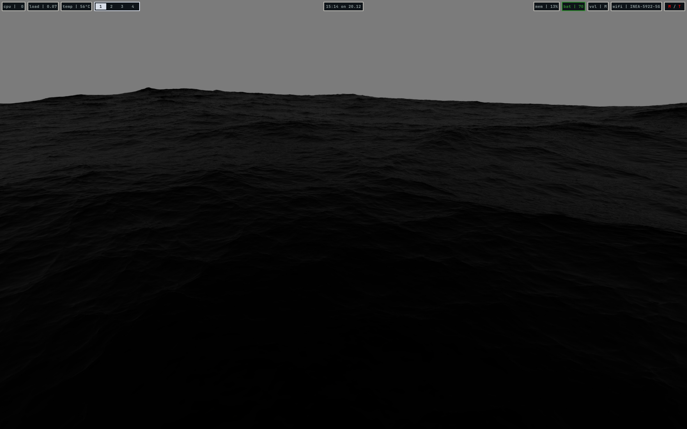
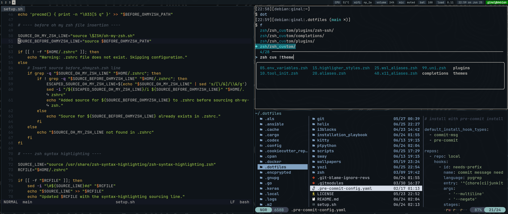

# My dotfiles




## Key Components

- Sway
- Alacritty
- Zsh (with Oh My Zsh)
- Helix (hx)

## Target Operating Systems

Primarily used and tested on:

- Debian
- Ubuntu

## Usage

Clone this repo and run the `setup.sh` script

## Requirements

### Terminal
- alacritty
- kitty

### Shell
- zsh
- oh my zsh
- [zsh syntax highlight](https://github.com/zsh-users/zsh-syntax-highlighting/blob/master/INSTALL.md)

### Editors
- helix

### Python
- pyenv
- pipx
- ptpython

### Window managers
- sway

### Tools
- tealdeer
- eza
- git
- github cli
- ripgrep
- htop
- batcat
- fzf
- fd-find
- wl-clipboard
- pulseaudio-utils
- grimshot
- delta pager
- tmux
- yazi
- slurp
- imagemagick
- batcat
- docker

### Other
- cargo
- fuzzel
- i3blocks
- macchina
- mako
- network manager
- keepassxc

### Browsers
- firefox

### Fonts

```sh
mkdir -p "${HOME}/.local/share/fonts"

JB_NL_BOLD="https://github.com/ryanoasis/nerd-fonts/raw/refs/tags/v3.4.0/patched-fonts/JetBrainsMono/NoLigatures/Bold/JetBrainsMonoNLNerdFontMono-Bold.ttf"
JB_NL_REGULAR="https://github.com/ryanoasis/nerd-fonts/raw/refs/tags/v3.4.0/patched-fonts/JetBrainsMono/NoLigatures/Regular/JetBrainsMonoNLNerdFontMono-Regular.ttf"
JB_NL_ITALIC="https://github.com/ryanoasis/nerd-fonts/raw/refs/tags/v3.4.0/patched-fonts/JetBrainsMono/NoLigatures/Italic/JetBrainsMonoNLNerdFontMono-Italic.ttf"

wget -P "${FONT_DIR}" "${JB_NL_BOLD}"
wget -P "${FONT_DIR}" "${JB_NL_REGULAR}"
wget -P "${FONT_DIR}" "${JB_NL_ITALIC}"

fc-cache -fv
```

### Prevent Accidental Pushes of Sensitive Data

To avoid pushing sensitive data, always create a separate branch for such changes.
The hook below blocks pushes from a specific branch (`<branch-name>`):

*Place it in .git/hooks/pre-push*

```sh
#!/bin/sh
branch="$(git symbolic-ref --short HEAD)"
if [ "$branch" = "<branch-name>" ]; then
  echo "Pushing branch '$branch' is blocked!"
  exit 1
fi
```
