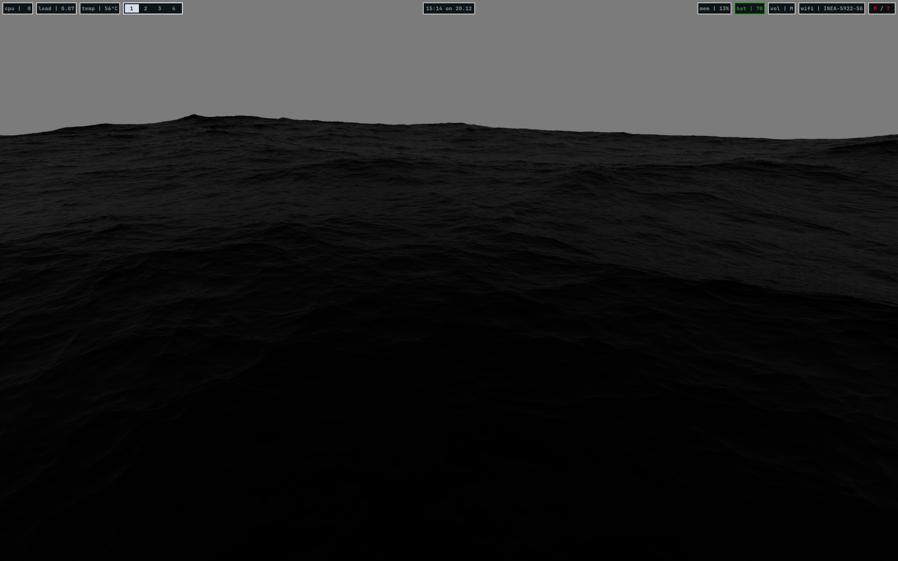
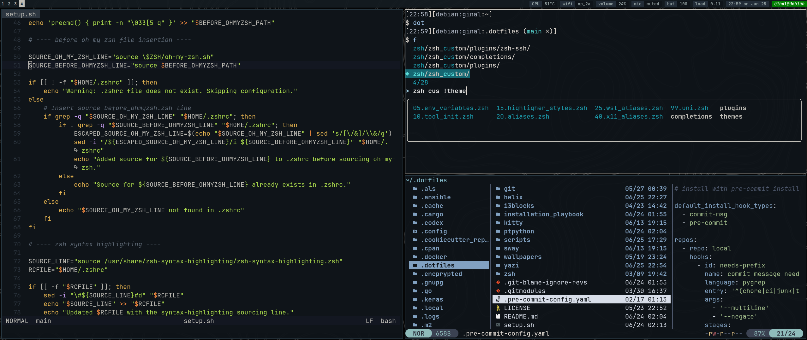

# My dotfiles




## Key Components

- Sway
- Alacritty
- Zsh (without Oh My Zsh)
- Helix (hx)

## Target Operating Systems

Primarily used and tested on:

- Debian
- Ubuntu

## Usage

Clone this repo and run the `setup.sh` script

## Requirements

### Terminal
- alacritty
- kitty

### Shell
- zsh

### Editors
- helix

### Python
- pipx
- ptpython

### Window managers
- sway

### Tools
- tealdeer
- eza
- git
- github cli
- ripgrep
- htop
- batcat
- fzf
- fd-find
- wl-clipboard
- pulseaudio-utils
- grimshot
- delta pager
- tmux
- yazi
- slurp
- imagemagick
- batcat
- docker

### Other
- cargo
- fuzzel
- i3blocks
- macchina
- mako
- network manager
- keepassxc

### Browsers
- firefox

## Fonts
**JetBrains Mono NL Nerd Font**.

To install the required styles (Bold, Regular, Italic), run:
`./dev/font_download.sh`

## Prevent Accidental Pushes of Sensitive Data

To avoid pushing sensitive data, always create a separate branch for such changes.
The hook below blocks pushes from a specific branch (`<branch-name>`):

*Place it in .git/hooks/pre-push*

```sh
#!/bin/sh

FORBIDDEN_BRANCH="<branch-name>"

while read local_ref local_sha remote_ref remote_sha; do

    if [ "$local_ref" = "refs/heads/$FORBIDDEN_BRANCH" ]; then
        echo "Pushing branch '$FORBIDDEN_BRANCH' is blocked!"
        exit 1
    fi

done

exit 0
```
## Repository structure

```
.
├── alacritty
│   └── alacritty.toml
├── assets
│   └── images
│       ├── sway_alacritty_screenshot.png
│       └── sway_screenshot.png
├── browser
│   ├── README.md
│   ├── userChrome.css
│   ├── vimium-c-style.css
│   └── vimium-options.json
├── dev
│   ├── font_download.sh
│   ├── mako_runner.sh
│   ├── README.md
│   ├── vimium_c_hints_exclude_generator.py
│   ├── waybar_runner.sh
│   └── zsh_startup_benchmark.sh
├── eza
│   └── theme.yml
├── fuzzel
│   ├── fuzzel.ini
│   ├── fuzzel.ini.blue
│   ├── fuzzel.ini.green
│   └── fuzzel.ini.white
├── git
│   └── config
├── helix
│   ├── config.toml
│   ├── languages.toml
│   ├── snippets
│   │   └── python.json
│   └── themes
│       └── ayu_dark_custom.toml
├── i3blocks
│   ├── config
│   └── scripts
│       ├── battery.sh
│       ├── custom.sh
│       ├── load.sh
│       ├── mic.sh
│       ├── mic_and_touchpad.sh
│       ├── recording.sh
│       ├── temp.sh
│       ├── time.sh
│       ├── volume.sh
│       └── wifi.sh
├── imv
│   └── config
├── installation_playbook
├── keyd
│   └── default.conf
├── kitty
│   ├── kitty.conf
│   └── theme.conf
├── LICENSE
├── ly
│   └── config.ini
├── macchina
│   ├── macchina.toml
│   └── themes
│       └── Hydrogen.toml
├── mako
│   └── config
├── ptpython
│   └── config.py
├── README.md
├── ruff.toml
├── scripts
│   ├── attempt_switch_to_empty_workspace_sway
│   ├── brightness_notification.sh
│   ├── convert_git_remotes_ssh_to_http
│   ├── copilot_wrapper.sh
│   ├── delta_features_toggle.py
│   ├── emoji_picker
│   ├── extract
│   ├── focus_or_open_firefox_sway
│   ├── format_json.py
│   ├── fzf_regex_open
│   ├── get_empty_workspace_sway
│   ├── gh_accept_invitation
│   ├── gh_collaborator_repo
│   ├── git-user-stats
│   ├── git_commit_formatter.py
│   ├── helix_blame_info.sh
│   ├── helix_git_log.sh
│   ├── keepassxc_select_and_copy_password
│   ├── koleo
│   ├── move_window_to_empty_workspace
│   ├── open_git_remote_browser
│   ├── open_google_service_with_account
│   ├── remove_changes_from_head
│   ├── remove_changes_merge_branch
│   ├── screencast_notify.sh
│   ├── screenshot_with_notification.sh
│   ├── sway_workspace_compact.py
│   ├── toggle_old
│   ├── toggle_screenrecording
│   ├── volume_notification.sh
│   ├── wait_for_wifi_network
│   ├── waybar_output_block_toggle.sh
│   └── zsh_history_fix
├── setup.sh
├── starship
│   └── config.toml
├── sway
│   ├── config
│   ├── config.d
│   │   ├── io_devices
│   │   └── keybinds
│   ├── doc
│   │   └── sway_cheat_sheet
│   └── themes
│       ├── blue
│       ├── green
│       └── white
├── swaync
│   ├── config.json
│   └── style.css
├── tealdeer
│   └── config.toml
├── tmux
│   └── tmux.conf
├── wallpapers
│   ├── 05_blue.jpg
│   ├── black_mountain.jpg
│   └── geo_pattern_even_darker.png
├── waybar
│   ├── config.jsonc
│   ├── style.css
│   └── themes
│       └── white.css
├── xdg-desktop-portal-wlr
│   └── config
├── yazi
│   ├── keymap.toml
│   ├── theme.toml
│   └── yazi.toml
├── zathura
│   └── zathurarc
└── zsh
    ├── before_ohmyzsh.zsh
    ├── entry.zsh
    └── zsh_custom
        ├── 05.env_variables.zsh
        ├── 05.zsh.zsh
        ├── 08.plugins.zsh
        ├── 10.hooks.zsh
        ├── 10.tool_init.zsh
        ├── 15.highlighter_styles.zsh
        ├── 20.aliases.zsh
        ├── 20.completions.zsh
        ├── 25.wsl_aliases.zsh.old
        ├── 40.x11_aliases.zsh
        ├── 50.keymap.zsh
        ├── 99.bootstrap.zsh
        ├── completions
        │   ├── _gh
        │   ├── _open_file_in_zathura
        │   ├── _remove_changes_merge_branch
        │   ├── _start_typst_preview
        │   └── _zathura
        └── plugins
            └── zsh-ssh
                ├── zsh-ssh.plugin.zsh -> zsh-ssh.zsh
                ├── zsh-ssh.zsh
                └── zsh-ssh.zsh.zwc
```
