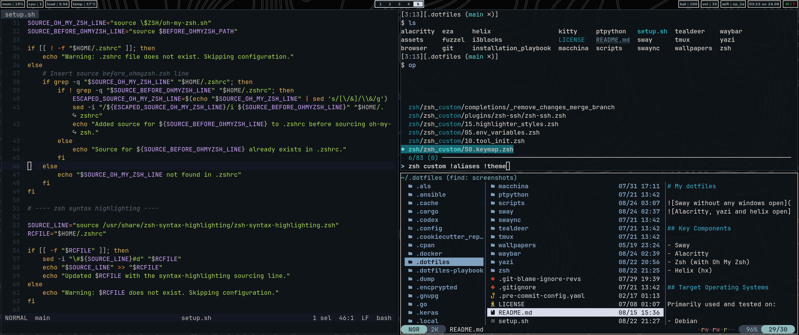

# My dotfiles




## Key Components

- Sway
- Alacritty
- Zsh (without Oh My Zsh)
- Helix (hx)

## Target Operating Systems

Primarily used and tested on:

- Debian
- Ubuntu

## Usage

Clone this repo and run the `setup.sh` script

## Requirements

### Terminal
- alacritty
- kitty

### Shell
- zsh
- oh my zsh
- [zsh syntax highlight](https://github.com/zsh-users/zsh-syntax-highlighting/blob/master/INSTALL.md)

### Editors
- helix

### Python
- pyenv
- pipx
- ptpython

### Window managers
- sway

### Tools
- tealdeer
- eza
- git
- github cli
- ripgrep
- htop
- batcat
- fzf
- fd-find
- wl-clipboard
- pulseaudio-utils
- grimshot
- delta pager
- tmux
- yazi
- slurp
- imagemagick
- batcat
- docker

### Other
- cargo
- fuzzel
- i3blocks
- macchina
- mako
- network manager
- keepassxc

### Browsers
- firefox

## Fonts
**JetBrains Mono NL Nerd Font**.

To install the required styles (Bold, Regular, Italic), run:
`./dev/font_download.sh`

### Prevent Accidental Pushes of Sensitive Data

To avoid pushing sensitive data, always create a separate branch for such changes.
The hook below blocks pushes from a specific branch (`<branch-name>`):

*Place it in .git/hooks/pre-push*

```sh
#!/bin/sh

FORBIDDEN_BRANCH="<branch-name>"

while read local_ref local_sha remote_ref remote_sha; do

    if [ "$local_ref" = "refs/heads/$FORBIDDEN_BRANCH" ]; then
        echo "Pushing branch '$FORBIDDEN_BRANCH' is blocked!"
        exit 1
    fi

done

exit 0
```
